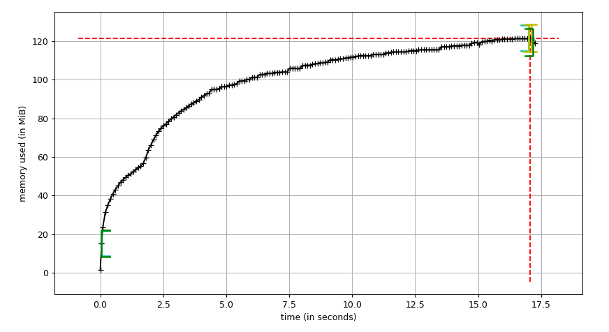

# **Key** Search engine

**KEY** is a python3.7 implementation of basic search engine, suitable for using as the autosuggest component. Based on nested dict Trie data structure, and aims to keep low memory footprint:

### Features:

- Loads denormalized geodata records from csv.

- Optimizes space usage by internally normalizing data via parsing and linking parent entities.

- Creates parent entities if they are missing in dataset. This allows to quickly fill parent data from the most detailed child entities.

- Supports flexible lookup by parsing record names into current and old name (specified in parentheses).

- Supports partial lookup by adding records to DictTrie (HashMap Trie) including all word suffixes.

- Provides import/export to normalized csv with parent ids.

- Handles lookups in wrong keyboard layout (e.g. `key` -> `лун`).

- Provides CLI tool for import/export, and interactive query mode.

- Provides simple Flask backend with search endpoint, and React frontend for fullstack experience.

[Live version](https://orlovol.netlify.com/)

### Things to improve

- **Explore Suffix automaton** (MA-FSA, DAWG), which could be used to **compress tree branches**, but it's not suitable for data that's changed often. However, a balanced combination could be found for items with less frequent updates.

- **Explore CTrie** data structure, which relies on atomic `CAS` operation. Python can be expanded with [atomos](https://atomos.readthedocs.io/en/latest/), which aims to provide support of said operations.

- **Multiprocess data import/export**, grouped by geo type.

- **Serialize and export Trie** to speed up initialization process.

- **Optimize Address names** and keep them in separate index. Most often they have same name for all languages `{street_id : address_numbers}`

- **Search results ranking** should be added. Results matched by prefix should be shown first, and then all results matched in the middle of the word. One idea is to track what is searched more often and rank those items higher. Second idea is to sort results by geo type, increasing/decreasing area.

- **More intelligent lookups** can be added, to account for typos and mixed/wrong cyrillic layouts, transliteration.

- **Database** could handle some work, but for simplicity sake all indexes are in memory to simulate some kind of cached storage (which is not used again for simplicity).

- **Pandas for csv** could be used, but standard `csv` module with few tricks is more than enough.

### Notable mentions:

- [Whoosh](https://whoosh.readthedocs.io/en/latest/index.html)

- [dict-trie](https://dict-trie.readthedocs.io/en/latest/index.html)

- [memory-profiler](https://pypi.org/project/memory-profiler/)